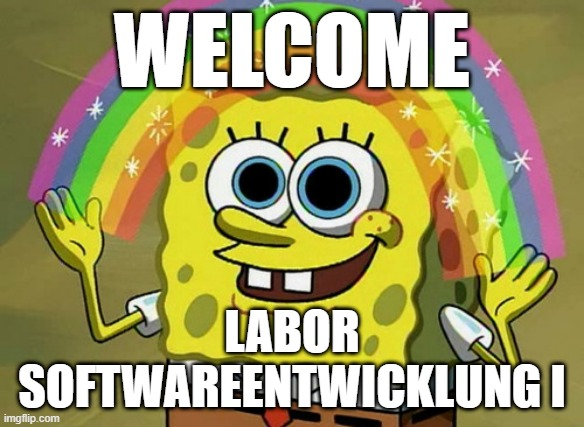 

---

# Experience Survey

https://form.jotform.com/223513864665058; Password: *dhbw2022*


---
# Goal of this Course

The goal of this course is to enable all participants to learn proper software engineering. Being a good software engineer takes **time**, **will** to improve yourself and **commitment**. 


<font size="+1"><a href=https://commons.wikimedia.org/wiki/File:Dunning-Kruger-Effect-en.png>wikimedia</a></font>

---

<style scoped>
  section{
  font-size: 20px;
  }
</style>

- [Welcome](#welcome)
- [Goal of this Course](#goal-of-this-course)
- [Literature](#literature)
- [Some Linux Basics](#some-linux-basics)
- [The Language **C**](#the-language-c)
- [The *basics* Example](#the-basics-example)
- [Common Environment](#common-environment)
- [Git](#git)
- [Basics in **C** #1](#basics-in-c-1)
- [What is **Compiling**?](#what-is-compiling)
- [CMake](#cmake)
- [User Input in **C**](#user-input-in-c)
- [Basics in **C** #2](#basics-in-c-2)
- [Functions](#functions)
- [Creating and Using Libraries](#creating-and-using-libraries)
- [Test Driven Development](#test-driven-development)
- [Debugging](#debugging)
- [Visual Studio Code](#visual-studio-code)
- [Clean Code](#clean-code)
- [Continuous Integration, Delivery \& Deployment](#continuous-integration-delivery--deployment)
- [Further stuff](#further-stuff)

---

<!-- paginate: true -->

<!-- header: Labor Softwareentwicklung 1, Q1 2023 -->

<!-- footer: Benjamin Wilking © -->

# Literature

<a id="literature"></a>

free c-books http://www.freebookcentre.net/Language/Free-C-Programming-Books-Download-1.htm

basics of this course https://www.phys.uconn.edu/~rozman/Courses/P2200_13F/downloads/TheBasicsofCProgramming-draft-20131030.pdf

---

# Excercises@Home & Exam  

## Homework
- Homework is voluntary but recommended.
- You are welcome to ask questions, I'm glad to help.

## Exam
- During the last 3 weeks of the course. 
- In teams of up to 3 people (2 preferred).
- Delivery in [Git](#git).

---

<style scoped>
  h1   {font-size: 60px}
  {font-size: 20px}
</style>

# Some Linux Basics
<a id="some-linux-basics"></a>

- open terminal ```ctrl + alt + t```
- go to home ```cd ~``` or just ```cd```
- go to last folder ```cd -```
- go to directory
  - absolute path ```cd /abspath/to/folder```
  - relative path ```cd ./relpath/to/folder```
  - one level up ```cd ..```
- create a new file ```touch my_new_file.ext```
- create a new directory ```mkdir my_new_dir```
- open file in editor ```nano my_new_file.ext``` (or any other editor)
- list content of current folder ```ls -la``` (```man ls```)
- remove file ```rm my_new_file.ext```
- remove directory ```rm -rf my_new_dir``` (:warning: very dangerous, always double check)
- put some text to a file ```echo "some strange text" >> my_textfile.txt```
- find text in file ```grep -rnw '.' -e 'strange' ```
- :point_up: "tab" completes your input and gives you your possibilities

---
## Task: Linux Basics

1. Go to your home folder. 
2. Create a new file in a new folder. 
3. "echo" some text to the file
4. open the file with an editor and add more lines
5. find a certain string in the file with *grep*
6. create a second empty file
7. delete the second file
8. delete the created folder

(in between, alwas check the current status with *ls*)

---

# The Language **C**

<a id="the-language-c"></a>

> **C** [...] is a general-purpose computer programming language. It was created in the 1970s by Dennis Ritchie, and remains very widely used and influential. [...]. **C** is commonly used on computer architectures that range from the largest supercomputers to the smallest microcontrollers and embedded systems. ([wikipedia](https://en.wikipedia.org/wiki/C_(programming_language)))


[If programming languages were vehicles](http://s3.crashworks.org.s3-website-us-east-1.amazonaws.com/if-programming-languages-were-vehicles/)

---

# The *basics* Example

<a id="the-basics-example"></a>

Create a new file **basics.c** with the following content

```C
int main()
{
  return 0;
}
```

compile it

```sh
gcc basics.c # using the gnu compiler
clang basics.c # using the clang compiler
```

the result is a binary called **a.out**.
You can run the program with ```./a.out```

---

If you want to give the binary a better name use the "**-o**" option

```sh
gcc basics.c -o basics 
```

You can check all possible options with

```sh
man gcc # or 'man clang'
```

Finally, you can run the binary with

```sh
./basics
```
:point_up: you can check the *return* value with: ```./basics; echo $?```

---

# Common Environment

<a id="common-environment"></a>

---

## Why Should I Use It?

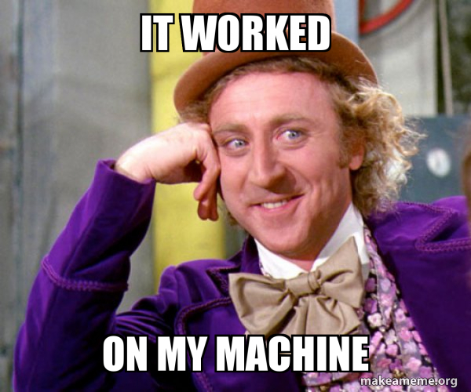

- Maybe you don't have a linux PC
- We all have the same system (compiler etc.)
  - If it works on your machine, it works on my machine
- Necessary tools and configs are already installed

---

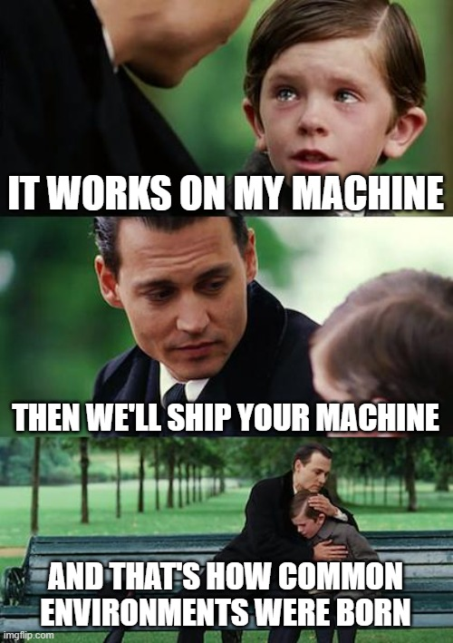

---

## VirtualBox

<a id="virtualbox"></a>

**VirtualBox** is a foss (free and open source software) virtual machine

You can download it [here](https://www.virtualbox.org/wiki/Downloads).

---

## What is a Virtual Machine

> In computing, a virtual machine (VM) is the virtualization/emulation of a computer system. ([wikipedia](https://en.wikipedia.org/wiki/Virtual_machine))

---

### Getting Started

- Where to download? &rarr; [moodle](https://todo/link/is/still/missing)
- Import the downloaded virtual machine
  
- select the imported machine and click 
- username: *learn2code*, password: *dhbw2022*

---

## gitpod

> [Gitpod](https://www.gitpod.io/) is an open-source Kubernetes application for ready-to-code cloud development environments that spins up fresh, automated dev environments for each task, in the cloud, in seconds. ([gitpod@github](https://github.com/gitpod-io/gitpod))
> 

You can use this [repo](https://github.com/BenniWi/learn-git) and the corresponding [gitpod](https://gitpod.io/#https://github.com/BenniWi/learn-git)
<a href="https://gitpod.io/#https://github.com/BenniWi/learn-git">

</a>

---

## GitHub Codespaces

> A codespace is a development environment that's hosted in the cloud. You can customize your project for GitHub Codespaces [...], which creates a repeatable codespace configuration [...]. ([github](https://github.com/features/codespaces))
> 

You can use this [repo](https://github.com/BenniWi/learn-git) and the corresponding [codespace](https://github.com/codespaces/new?hide_repo_select=true&ref=main&repo=559622217&machine=basicLinux32gb&location=WestEurope)

[](https://github.com/codespaces/new?hide_repo_select=true&ref=main&repo=559622217&machine=basicLinux32gb&location=WestEurope)

---

# Git

<a id="git"></a>


> Git is a free and open source distributed version control system designed to handle everything from small to very large projects with speed and efficiency. ([Git](https://git-scm.com/))

---

## What is Version Control

> In software engineering, version control (also known as revision control, source control, or source code management) is a class of systems responsible for managing changes to computer programs, documents, large web sites, or other collections of information. ([wikipedia](https://en.wikipedia.org/wiki/Version_control))

---
### Version Control Example Graph

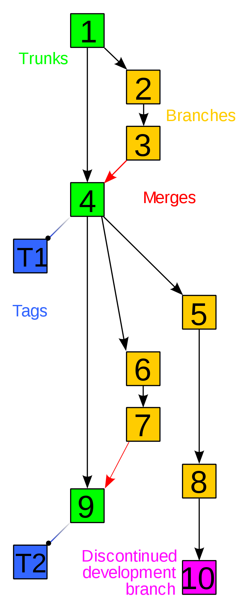

---

### TensorFlow - Most Famous Project on GitHub


>TensorFlow is an end-to-end open source platform for machine learning. ([TensorFlow@GitHub](https://github.com/tensorflow/tensorflow))
</br>
[Example Blame](https://github.com/tensorflow/tensorflow/blame/master/tensorflow/c/tf_tensor.cc)

---

## Working on a Local Repository

```sh
mkdir test_repo && cd test_repo
git init # initialize the repository
git status # check status of repository
echo "my first line" > first_file.txt # write something to a new file 
# -> check status
git add first_file.txt # add the file to version control 
# -> check status
git commit -m"initial commit (short msg)" -m"description (long msg)"
# commit the change to the repo 
# -> check status
gitk # opens the git native commit graph
git gui # opens the git native user interface
git log # check your changes on the command line
git log --graph # show the commit graph on command line
```

---

### Task: Branching in Git

1. create a branch with ```git branch my_new_feature```
2. check the available branches with ```git branch```
3. switch to you new branch with ```git checkout my_new_feature```
4. add a new file and edit the one you already have
5. commit your changes
6. switch back to your *main/master* branch
7. merge your changes to your *main/master* with ```git merge my_new_feature```
8. delete your feature branch with ```git branch -D my_new_feature```
9. check your commit graph

:point_up: always remember to check your work with ```git status```

---

## Working on a Remote Repository

we are working on this public repository https://github.com/BenniWi/learn-git

```sh
git clone git@github.com:BenniWi/learn-git.git # get the repo
cd learn-git
mkdir <choose a folder name>
echo "some text" > <your folder name>/<your file name>
# add and commit your changes
git push # bring local changes to the remote repo
```

It is very likely, that you will run into problems because the remote repo has changed in the meantime. Try one of these:
```sh
git pull --rebase
git pull --merge
```

---

## Some Basics for Git

- do not add binary (large) files
- always write a descriptive message (short + long)
- use [.gitignore](https://git-scm.com/docs/gitignore) to keep your workspace clear
- get familiar with the command line
- learn the [best practices](https://sourcelevel.io/blog/7-git-best-practices-to-start-using-in-your-next-commit)

---

# Basics in **C** #1

<a id="basics-in-c-1"></a>

<!-- 
13.01.   Einführung Variablen und Datentypen Zeiger Datenstrukturen (struct, enum, Listen…)
03.02.   Kontrollstrukturen (if, switch case, for, while, do while) Funktionen
-->

---

## Using the **C** Standard Library

> The **C** standard library or *libc* is the standard library for the [**C** programming language](https://en.wikipedia.org/wiki/C_(programming_language)), as specified in the [ISO C](https://en.wikipedia.org/wiki/ISO_C) standard. [...]. <br>
> The **C** standard library provides macros, type definitions and functions [...].
> ([wikipedia](https://en.wikipedia.org/wiki/C_standard_library))

---

## Print Something to the Console

```C
#include <stdio.h>  //specify where to look for the functions you need
int main()
{
  /* print something to the command line
  make sure to end with a new line "\n"
  you can find more "control-characters" 
  on e.g. https://en.wikipedia.org/wiki/Control_character
  BTW: this is a multi-line comment */
  printf("Hello World!\n");

  return 0;
}
```

[printf](https://en.cppreference.com/w/c/io/fprintf)

---

## Macros

```C
#include <stdio.h>  //specify where to look for the functions you need

//define a macro, from now on we can use "new_line" instead of "\n"
#define new_line "\n" 

int main()
{
  // append the macro to the string
  printf("Hello World!"new_line);

  return 0;
}

```

[define](https://en.cppreference.com/w/c/preprocessor/replace)

---

## Variables & Data Types

As a programmer you want to work with variables to remember a certain value.
In **C**, there are three kinds of basic data types for variables

- **int** - integer (whole number) values
- **float** - floating point values
- **char** - single character values (such as “m” or “Z”)

---

### Working with Variables

Defining and using a variable in the code is quite easy:

```C
int main()
{
  int x; // defines an integer variable named x
  float y = 1.0; // defines a variable and assigns a value

  x = 5; // initialize x before first usage
  x = x+x; // re-assign a value to x
  return 0;
}
```

---

### Printing Variables to the Console

Using [printf](https://en.cppreference.com/w/c/io/fprintf), the output depends on the datatype!

- **int** (integer values) uses **%d**
- **float** (floating point values) uses **%f**
- **char** (single character values) uses **%c**
- **character strings** (arrays of characters, discussed later) use **%s**

```C
printf("my int %d; my float %.2f; my char %c\n", x, y, c)
```

---

## Operators

- ```+``` − addition
- ```−``` − subtraction
- ```/``` − division
- ```∗``` − multiplication
- ```%``` − modulo

Operator precedence is comparable to mathematics.

There are [many more](https://en.cppreference.com/w/c/language/expressions), you should go through them at least once!

---

Some operators make life easier!

```C
x = x + 1; <-> ++x; 
x = x + y; <-> x+=y;
```

:warning: **NEVER** rely on operator precedence

```C
int a = 1;
int b = a++; // stores 1+a (which is 2) to a
             // returns the value of a (which is 1)
             // After this line, b == 1 and a == 2
a = 1;
int c = ++a; // stores 1+a (which is 2) to a
             // returns 1+a (which is 2)
             // after this line, c == 2 and a == 2
```

(example from [here](https://en.cppreference.com/w/c/language/operator_incdec))

---

## Structures & Arrays

---

### Structures

```C
int main()
{
  // declare a structure and name it "my_struct"
  struct my_struct 
  {
    int a,b,c;
    float d,e,f;
  }ms1; // instantly instantiate a structure of this type with name ms1
  // instantiate a structure without initialization -> be careful
  struct my_struct ms2;
  // instantiate a structure with initialization
  struct my_struct ms3 = {.a=5, .b=6, .c=7, .d=0.1, .e=0.2, .f=0.3};

  return 0;
}
```

---

```C
// globally defined structure
struct outer_struct 
{
  int a,b,c;
  float d,e,f;
};

// declare a new type of structure
// typedef can be used to define any kind of new type
// https://en.cppreference.com/w/c/language/typedef
typedef struct 
{
  int a,b,c;
  float d,e,f;
} outer_td_struct;

int main()
{
  //locally instantiated structure with direct initialization 
  struct outer_struct or = {.a=5, .b=6, .c=7, .d=0.1, .e=0.2, .f=0.3};

  //using the new type of structure
  outer_td_struct otd = {.a=5, .b=6, .c=7, .d=0.1, .e=0.2, .f=0.3};

  return 0;
}
```

---

### Arrays

```C
int main()
{
  int a[5]; // declare an array without initialization -> be careful
  int b[5] = {0}; // initialize all values with zeros
  int c[5] = {22, 33, 44, 55, 66}; // initialize all values explicitly
  int d[] = {22, 33, 44, 55, 66};  // you don't need to specify the size
  int e[5];
  e[0] = 10; // !!! array indices always start at 0 ....
  e[1] = 3;
  e[2] = 13;
  e[3] = 22;
  e[4] = 77; // ... and end with n-1

  return 0;
}
```

---

## Pointers

---

### Using Pointers

```C
int i, j;
int *p; // define pointer to integer. p holds a random unknown address now
// trying to use *p most probably creates a seg fault
printf("uninitialized: p points to: %lu\n", p); // %lu is "long unsigned" 
p = &i; // assign the address of i to p
printf("initialized p, uninitialized i: value *p=%d, p points to %lu\n", *p, p);
*p = 5; // assign value to the memory of the pointer
printf("initialized p, initialized i: value *p=%d, p points to %lu\n", *p, p);
j=i;    // copy the value from i to j
printf("i=%d, j=%d, value *p=%d, p points to %lu\n", i, j, *p, p);
```

---

### Size of Pointers

```C
// sizeof returns the size of a datatype in bytes
// lets test the size of some basic datatypes
printf("size of char: %d\n", sizeof(char));
printf("size of int: %d\n", sizeof(int));
printf("size of float: %d\n", sizeof(float));
printf("size of double: %d\n", sizeof(double));
printf("size of long: %d\n", sizeof(long));
// lets test the size of the corresponding pointers
printf("size of char*: %d\n", sizeof(char*));
printf("size of int*: %d\n", sizeof(int*));
printf("size of float*: %d\n", sizeof(float*));
printf("size of double*: %d\n", sizeof(double*));
printf("size of long*: %d\n", sizeof(long*));
```

---

# What is **Compiling**?

<a id="what-is-compiling"></a>

---

## Preprocessor - Compiler - Linker

### Preprocessor

```sh
gcc -E basics_in_c_macro.c
# or
clang -E basics_in_c_macro.c
```

Can you figure out what the preprocessor does?

---

### Compiler

```sh
clang -c basics_in_c_macro.c
nano example_2_macro.o # naive approach to show content of object file
objdump -D example_2_macro.o # use linux tools to inspect the file
```

TODO: Task - create a compiler flag list for the following flags

```sh
clang -Wall -Wextra -Werror -pedantic -O0 example_2.c
```

---

### Linker

We did not call the linker!
Well, let's check if we linked something

```sh
ldd a.out
```

---

## Compiler vs. Interpreter

[compiler vs interpreter](https://www.ionos.de/digitalguide/websites/web-entwicklung/compiler-vs-interpreter/)

### C

```C
#include <stdio.h>
int main()
{
    printf("Hello World!\n");

    return 0;
}
```

```sh
clang basics_in_c.c && ./a.out
```

---

### Python

```Python
print("Hello World!")
```

```sh
python3 basics_in_c_python.py
```

What are the advantages of the interpreter language?
What are the downsides?

---

# CMake

<a id="cmake"></a>


> CMake is an open-source, cross-platform family of tools designed to build, test and package software. CMake is used to control the software compilation process using simple platform and compiler independent configuration files [...]. ([CMake](https://cmake.org/))

---

## Write a CMake Config

CMake config is always a file named CMakeLists.txt

```cmake
# define the minimum cmake version
cmake_minimum_required(VERSION 3.20)

# define the project name
project(cmake_example VERSION 1.0) # do not overwrite cmake ;-)

# define the c standard version
set(CMAKE_C_STANDARD 11)
set(CMAKE_C_STANDARD_REQUIRED True)

# add some compile options
add_compile_options(-Wall -Wextra -Werror -pedantic -O0)

# add an executabel and assign files to it
add_executable(${PROJECT_NAME} cmake.c)
```

---

## Running CMake

```sh
cd <folder-with-CMakeLists.txt>
cmake . # run cmake
make # build your project
./cmake_example # run your binary
```

Result: your workspace gets polluted :unamused:

---

Define sources and build folder

```sh
cmake -S . -B build
```

Still, there are some things undefined.
Add:

```sh
-G "Unix Makefiles" 
-D CMAKE_C_COMPILER=clang 
-D CMAKE_CXX_COMPILER=clang++ 
```

Figure out what these options are doing with:

```sh
cmake --help
```

---

Still, calling **CMake** seems to be tedious :sweat:
Let's create a small script for that.
Create a file called *run_cmake.sh*

```sh
#!/bin/bash
cmake -S . -B build #add all your options
```

---

## CMake Misc

1. You probably recognized, that you have to go to the *build* folder bevor calling ```make``` :wink:
2. Can you run your script *run_cmake.sh*? Probably not! Try ```chmod +x run_cmake.sh```! - What does this?

---

# User Input in **C**

<a id="user-input-in-c"></a>

- Reading user input is as easy as printing something.
- Similar to [printf](https://en.cppreference.com/w/c/io/fprintf) we use [scanf](https://en.cppreference.com/w/c/io/fscanf) to read in values.
- The **type** of data is important, e.g. ```%d``` for integer values

```C
// read in an integer value from the console
scanf("%d", &val1) ;
```

:point_up: The ```&``` sign is very important. We learned that in the chapter  [*pointers*](#pointers)

---

# Basics in **C** #2

<a id="basics-in-c-2"></a>

---

## Branching & Looping

---

### if

```C
  int b;
  printf("Enter a value:");
  scanf("%d",&b);
  if(b < 0)
  {
    printf("The value is negative\n");
  }
  else if(b==0)
  {
    printf("The value is zero\n");
  }
  else
  {
    printf("The value is positive\n");
  }
```

Read more  about [comparison operators](https://en.cppreference.com/w/c/language/expressions)

---

### switch case

```C
int a=2;
switch(a) {
	case 1: printf("a is one\n"); break;
	case 2: printf("a is two\n"); break;
	case 3: printf("a is three\n"); break;
	default: printf("a is something else\n"); break;
}
```

---

### while

```C
int a = 0, b = 10;
while (a < b)
{
  printf("%d\n", a);
  a++;
}
```

```C
int a = 0, b = 10;
do
{
  printf("%d\n", a);
  a++;
}while (a < b);
```

---

### for

> The for loop in C is simply a shorthand way of expressing a while statement ([The Basics of C Programming](https://www.phys.uconn.edu/~rozman/Courses/P2200_13F/downloads/TheBasicsofCProgramming-draft-20131030.pdf))

```C
int a = 0, b = 10;
while (a < b)
{
  printf("%d\n", a);
  a++;
}
```

```C
int a, b;
for (a = 0, b = 10; a < b; a++)
{
  printf("%d\n", a);
}
```

---

# Functions

<a id="functions"></a>

So far, we wrote spaghetti-code :spaghetti:
We can change this by defining a **function**

```C
return_value my_function_name(<datatype> input_1, <datatype> input_2)
{
  <do something>
  return <a value>;
}
```

Put this **IN FRONT** of your main and you can use the function in the code!

---

## Create a Prototype

The overview is not very good having all the functions in front of the *main*.
You can create a **prototype** only instead:

```C
return_value my_function_name(<datatype> input_1, <datatype> input_2);
```

Now, you can *define* the function **AFTER** the **main**

```C
int main(void) {return 0;}

return_value my_function_name(<datatype> input_1, <datatype> input_2)
{
  <do something>
  return <a value>;
}
```

---

## Create Files for Prototype and Definition

Even with the prototype, the overview is not perfect. Putting code in separate files would help!

1. Create a header file for the prototype (e.g. *include/functions.h*). Always use include guards
2. Create a source file for the definition (e.g. *src/functions.c*)
3. Include the header in your main file
4. Tell the compiler where to find everything (*CMakeLists.txt*)

---

## TODO

Const correctness, pointer als übergabe-parameter

---

## Future Project Structure

From now on, we will stick to the following folder structure

- \<project-name\>
  - `include` (-> contains all header files)
  - `src`     (-> contains all source files)
  - `test`    (-> contains test files)
  - `doc`     (-> contains relevant files for documentation)
  - `CMakeLists.txt`
  - `readme.md`
  - ...

---

# Creating and Using Libraries

<a id="creating-and-using-libraries"></a>

So, we learned how to extract code into extra files :sparkler:.
It could be even better.
How about creating an own library - like the **C** standard library we use all the time?

---

## Types of Libraries

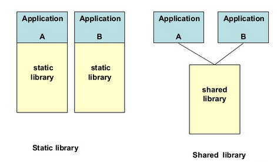 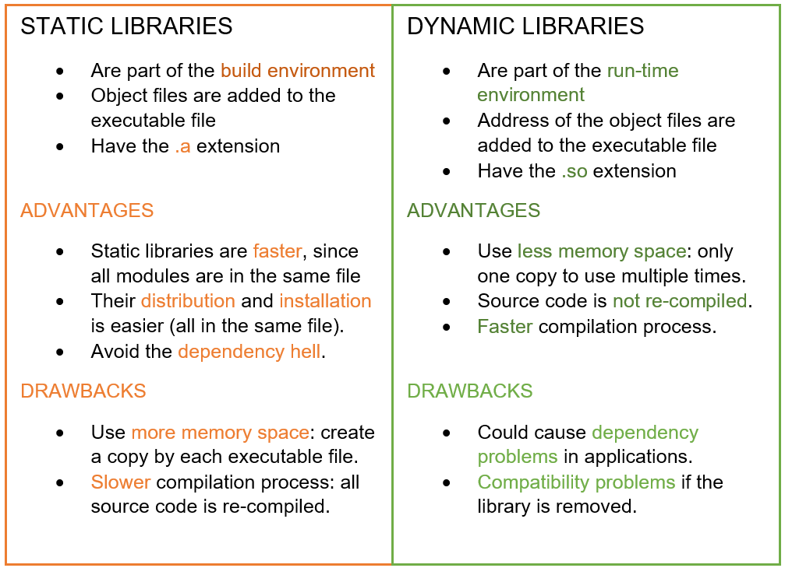
[source](https://medium.com/@wendymayorgasegura/dynamic-library-vs-static-library-8b28bae039de) &nbsp; &nbsp; &nbsp; &nbsp; &nbsp; &nbsp; &nbsp; &nbsp; &nbsp; &nbsp; &nbsp; &nbsp; &nbsp; &nbsp; &nbsp; &nbsp;&nbsp; &nbsp; &nbsp; &nbsp; &nbsp;&nbsp;&nbsp;[source](https://medium.com/@luischaparroc/https-medium-com-luischaparroc-dynamic-libraries-in-c-96a989848476)

---

## How to Create a Library

On Linux and using *CMake*, creating a library is dead simple :sparkles:

```cmake
# add a library
add_library(<library_name> <STATIC | SHARED> <source_files>)
# add the includes to the library
target_include_directories(<library_name> PUBLIC include)
```

Now, you can use the new library for your executable

```cmake
# add an executable and assign files to it
add_executable(${PROJECT_NAME} src/main.c)
# add the include directories
target_include_directories(${PROJECT_NAME} PUBLIC include)
# link your libraries
target_link_libraries(${PROJECT_NAME} PRIVATE <library_name>)
```

<font size="+1">To be honest: using (3rd party) libraries can be extremely tedious &#128546;</font>

---

TODO: create a task to create a static and a shared library and also check the result with ldd

---

# Test Driven Development

<a id="test-driven-development"></a>

> Test-driven development (TDD) is a software development process relying on software requirements being converted to test cases before software is fully developed, and tracking all software development by repeatedly testing the software against all test cases. ([wikipedia](https://en.wikipedia.org/wiki/Test-driven_development))

---

## TDD Process

1. What are your requirements? What do you want to achieve?
2. Write your tests (using a test framework)
3. Write the most simple code to pass the tests
4. Improve your code to pass all tests
5. Beautify the code

---

## googletest


> googletest is a testing framework developed by the Testing Technology team with Google’s specific requirements and constraints in mind. Whether you work on Linux, Windows, or a Mac, if you write C++ code, googletest can help you. ([googletest](https://google.github.io/googletest/primer.html))

---

## How to Use googletest

1. You only can test libraries, not executables
2. googletest is a **C++** library, so we have to use **C++** for our tests
3. add googletest to your *CMakeLists.txt*
4. write your tests
5. Run your tests

---

### Add googeltest to Your CMakeLists.txt

```cmake
# enable the testing
enable_testing()
# check if we have gtest
find_package(GTest REQUIRED)
# include the gtest CMake stuff
include(GoogleTest)
# create a test executable
add_executable(tests test/test_functions.cpp)
# link the gtest libraries
target_link_libraries(tests PRIVATE GTest::GTest GTest::Main)
# link the library we want to test
target_link_libraries(tests PRIVATE ${PROJECT_NAME}_lib)
# add the include directories
target_include_directories(tests PUBLIC include)
# discover and add tests to the test list
gtest_discover_tests(tests)
```

---

### Write a Test

```C
#include "gtest/gtest.h" // include the gtest functions & macros
extern "C" { //the library we want to us is written in C
  #include "functions.h"
}

// the first test we want to write
TEST (example8_tests, add_standard_integers) { 

    EXPECT_EQ (11, add_integers(5,6));
}
```

---

### Run the Tests

after compiling everything you have two possibilites:
``` cd <build_folder>```
run ```ctest``` or the test target ```./tests```

---

# Debugging

<a id="debugging"></a>

- extend CMake Build with: -D CMAKE_BUILD_TYPE=Debug
  - you need the compiler to create debug symbols
- either use gdb or lldb https://lldb.llvm.org/use/map.html

---

## Debug with **lldb**

```sh
lldb example_9
(lldb) breakpoint set --file main.c  --line 8
(lldb) process launch
(lldb) help # to get the possible commands
(lldb) v # shows all variables
(lldb) v val1 # shows only variable val1
(lldb) s # step to next line or step into current function
(lldb) c # continue to next breakpoint or end
(lldb) exit # leave lldb
```

You can do exactly the same with your *tests* as target

---

## Debug With **gdb**

```sh
gdb example_9
(gdb) break main.c:8
(gdb) run
(gdb) help # to get the possible commands
(gdb) info locals # shows all variables
(gdb) p val1 # shows only variable val1
(gdb) s # step to next line or step into current function
(gdb) next # continue to next breakpoint or end
(gdb) q # leave gdb
```

You can do exactly the same with your *tests* as target

---

# Visual Studio Code

<a id="visual-studio-code"></a>

Until now, we did everything on the command line.
It is time to get a bit lazy :smirk:
(You have to have the [CMake Tools Extension](https://code.visualstudio.com/docs/cpp/cmake-linux) installed)

---

## VS Code - Loading the Project

- ```sh
  cd example_9
  code . # start visual studio code
  ```
- right click *CMakeLists.txt* &rarr; *Configure All Projects*
- If you are asked for to select a *kit* &rarr; select one for linux
  

---

## VS Code - Build, Run & Debug

After configuring the project, you can build, run & debug your project using the extension buttons on the bottom of the window.


There, you can also change:

- build toolkit
- Debug/Release configuration
- build target
  ...

(Setting breakpoints in a code file is easy, try to figure it out)

---

## VS Code - Git

There are also several Git Extensions.
A very good one is [Git Lense](https://marketplace.visualstudio.com/items?itemName=eamodio.gitlens).
Even if is absolutely **mandatory** to know the git command line, VS Code gives you some comfort:

- Check the git symbol on the left of VS Code
- Check the additional right click actions for files
- ...

---

# Continuous Integration, Delivery & Deployment

<a id="continuous-integration-delivery--deployment"></a>

---

## Continuous Integration

> In software engineering, continuous integration (CI) is the practice of merging all developers' working copies to a shared mainline several times a day. ([wikipedia](https://en.wikipedia.org/wiki/Continuous_integration))

---

## Continuous Delivery

> Continuous delivery (CD) is a software engineering approach in which teams produce software in short cycles, ensuring that the software can be reliably released at any time and, when releasing the software, without doing so manually. ([wikipedia](https://en.wikipedia.org/wiki/Continuous_delivery))

---

## Continuous Deployment

> Continuous deployment (CD) is a software engineering approach in which software functionalities are delivered frequently and through automated deployments. ([wikipedia](https://en.wikipedia.org/wiki/Continuous_deployment))

---

## **CI/CD** Tools

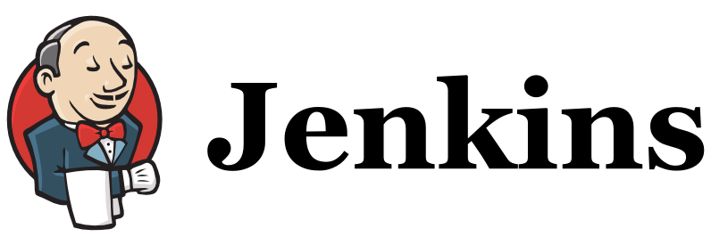 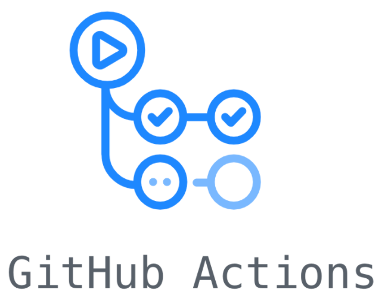 

---

## Github Actions

**Github Actions** allow you to continuously integrate, deliver and even deploy your software.
For now, we want to use **Github Actions** to *build* and *test* our software continuously.
<br>
:point_up: There is way more we could do, but that's the absolute minimum

---

### Create New Action (Pipeline)

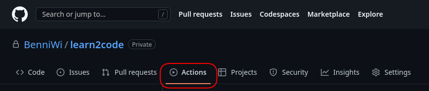

---

### Add a Workflow

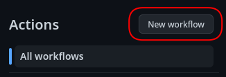

---

### Add CMake Workflow

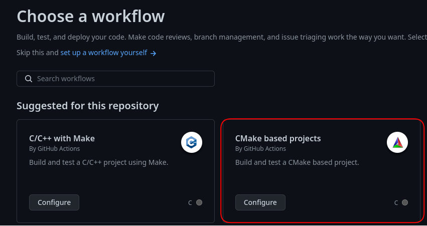

---

### Specify Your Build Commands

You will get a first proposal for your workflow file.
E.g. *.github/workflows/cmake.yml*
In this file you need to make sure, that

1. gtest is installed (if you need it)
2. all your build steps are executed
3. all your paths are correct
   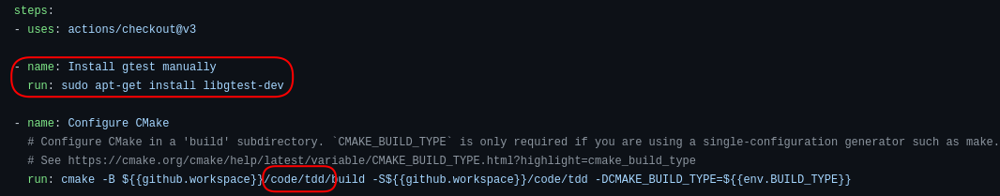

---

# Clean Code

<a id="clean-code"></a>

TODO
- using doxygen
- using clang-format

---

# Dynamic Memory

<a id="dynamic-memory"></a>

---

# Commandline Arguments

<a id="further-stuff"></a>

---

# Further stuff

<a id="further-stuff"></a>

- strings?
- advanced pointers
