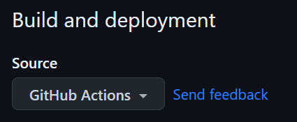

---

<style scoped>
  section{
  font-size: 20px;
  }
</style>

## Table of Contents

<a id="table-of-contents"></a>

- [Literature](#literature)
- [Exercises@Home \& Exam](#exerciseshome--exam)
- [Preparations for Every Lesson](#preparations-for-every-lesson)
- [From *C* to *C++*](#from-c-to-c)
- [Testing Code \& Test Driven Development](#testing-code--test-driven-development)
- [Dynamic Memory in *C* \& *C++*](#dynamic-memory-in-c--c)
- [Inheritance](#inheritance)
- [The *static* Keyword](#the-static-keyword)
- [clang-tidy Coding Support](#clang-tidy-coding-support)
- [Polymorphism](#polymorphism)
- [Templates](#templates)
- [STL](#stl)
- [Type Casting](#type-casting)
- [*doxygen* Code Documentation](#doxygen-code-documentation)


---

<!-- paginate: true -->

<!-- header: Labor Softwareentwicklung 2, Q2 2023 -->

<!-- footer: Benjamin Wilking © -->

# Literature

<a id="literature"></a>

[free C++-books](https://tfetimes.com/free-c-books/)

---

# Exercises@Home & Exam  

<a id="exerciseshome--exam"></a>

## Homework

- Homework is voluntary but strongly recommended.
- You are welcome to ask questions, I'm glad to help.

## Exam

- During the last 3 weeks of the course.
- In teams of up to 3 people (2 preferred).
- Delivery in [Git](slides_learn2code_1.md#git).

---

# Preparations for Every Lesson

<a id="preparations-for-every-lesson"></a>

Complexity is increasing very fast, so make sure to

1. maintain a working repository (preferably on [GitHub](https://github.com/))
   - [CMake](https://cmake.org/) is mandatory
2. add our code from the lessons to this repository
   - try to evolve your [Git](https://git-scm.com/) capabilities
3. keep a continuous integration running on the repository (only with GitHub)
4. finish the tasks from the lessons at home
5. stick to coding conventions (clang-format, clang-tidy, doxygen)

---

# From *C* to *C++*

<a id="from-c-to-c"></a>

---

## Enable *C++* Language in *CMake*

```CMake
# define the project name
project(basics_in_Cpp VERSION 1.0 LANGUAGES CXX)

# define the c standard version
set(CMAKE_CXX_STANDARD 14)
set(CMAKE_CXX_STANDARD_REQUIRED True)
```

---

## *C++* Filenames

In order to tell CMake and the compiler you should use the following file names:

```*.cpp``` for all source files
```*.h``` and ```*.hpp``` for all header files

---

## *C++* Hello World

```cpp
#include <iostream>

auto main() -> int // see also "trailing return type"
{
    std::cout << "Hello World" << std::endl;

    return 0;
}
```

---

## From Structs to Classes

### *C++* Struct

```cpp
// old C-Style 
typedef struct 
{
 ....
}MyCppStruct;

// modern C++-Style
using MyCppStruct = struct
{
 ....
};
```

---

```cpp
using MyCppStruct = struct
{
    int16_t a = 0; // type from cstdint https://en.cppreference.com/w/cpp/types/integer
    float b = 0.0F;

    void print() const
    {
        std::cout << "a = " << a << "; b = " << b << std::endl;
    }
};

auto main() -> int
{
        MyCppStruct my_struct;
        std::cout << "Printing struct my_struct: " << std::endl;
        my_struct.print();
}
```

---

### *C++* Class

```cpp
class MyCppClass
{
   public:  // C++ Access Specifiers
    int16_t a = 0;
    float b = 0.0F;

    void print() const
    {
        std::cout << "a = " << a << "; b = " << b << std::endl;
    }
};

auto main() -> int
{
        MyCppClass my_class;
        std::cout << "Printing class my_class: " << std::endl;
        my_class.print();
}
```

---

### Parts of a *C++* Class

```cpp
class MyCppClass
{
// publics are accessible from outside the class
   public:  
    float pub_member_var = 0.0F; // public member variable
    void pub_member_func(){}     // public member function (method)
    // Constructor: A constructor in C++ is a special method that is 
    // automatically called when an object of a class is created.
    MyCppClass();
    // There is also a destructor, but we don't use it for now
    ~ MyCppClass();
// privates cannot be accessed (or viewed) from outside the class
   private: 
    float priv_member_var = 0.0F; // private member variable
// protected elements cannot be accessed from outside the class, 
// but can be accessed in inherited classes.
   protected: 
    void prot_member_func(){}     // protected member function (method)
};
```

---

### *C++* Class Declaration

Class declaration :arrow_right: normally goes into the header file

```cpp
class Student
{
   public:
    int16_t num_of_exams = 0;
    int32_t id_number;
    std::string name;
    // define a constructor
    Student(std::string par_name, int32_t par_id);
    void print() const;
};
```

---

### *C++* Class Definition

Class definition :arrow_right: normally goes into the cpp file

```cpp
Student::Student(std::string par_name, int32_t par_id) : name{par_name}
{
    /*
        Initialization can be done
        1. directly in the declaration
        2. in the initializer list of the constructor definition
        3. in the constructor itself
    */
    id_number = par_id;
}
void Student::print() const
{
    // print code goes here!
}
```

---

### *C++* Class Exercise

Take the "student" example from above and ...

1. add a **private** member for the *bank account number*
2. extend the *constructor* to initialize the bank account number
3. write an *update_bank_account* method to update the bank account number
4. implement the *print* method

You can find the code for this exercise in the file [struct_to_class.cpp](https://github.com/BenniWi/learn2code/blob/main/code/part_2/basics_in_Cpp/struct_to_class.cpp)

---

## Namespaces

---

```cpp
namespace my_awesome_namespace
{
class AwesomeClass
{
   public:
    int16_t a = 0;  // type from cstdint https://en.cppreference.com/w/cpp/types/integer
    float b = 0.0F;

    void print() const
    {
        std::cout << "a = " << a << "; b = " << b << std::endl;
    }
};
}  // namespace my_awesome_namespace

auto main() -> int
{
    my_awesome_namespace::AwesomeClass my_class;
    my_class.print();
}

```

---

```cpp
namespace my_awesome_namespace
{
  ....
}  // namespace my_awesome_namespace

namespace my_awesome_namespace
{
namespace my_more_awesome_namespace
{
class MoreAwesomeClass
{
   public:
    static void print_hello()
    {
        std::cout << "hello from a static class method in namespace" << std::endl;
    }
};
};  // namespace my_more_awesome_namespace
}  // namespace my_awesome_namespace

auto main() -> int
{
    my_awesome_namespace::my_more_awesome_namespace::MoreAwesomeClass::print_hello();
}
```

---

### **"using"** Namespaces

The [keyword](https://en.cppreference.com/w/cpp/language/using_declaration) ```using``` simplyfies things a lot.

```cpp
using namespace std
[...]
cout << "Hello World" << endl;
```

:warning: But:

- :zap: *NEVER* :zap: put ```using``` into a header file
- you *MIGHT* put it into the source file carefully
- prefer [namespace aliases](https://en.cppreference.com/w/cpp/language/namespace_alias) (only in source files)
  ```namespace fbz = foo::bar::baz;```

---

## References in *C++*

> A reference variable is an alias, that is, another name for an already existing variable. A reference, like a pointer, is also implemented by storing the address of an object. [[geeksforgeeks](https://www.geeksforgeeks.org/pointers-vs-references-cpp/)]

```cpp
int i = 3;
int a = 10;
// A pointer to variable i or "stores the address of i"
int *ptr = &i;
// A reference (or alias) for i.
int &ref = i;
// reassignment
ptr = &a;  // that's fine
&ref = a;  // ERROR as we should declare and initialize references at single step
// this means: also re-initialization is not possible
```

---

### References as Arguments in *C++*

```cpp
class MyTestClass
{
   public:
    int test_member = 0;
};

void function_with_copy(MyTestClass mtc)
{
    mtc.test_member = 1;
}

void function_with_reference(MyTestClass &mtc)
{
    mtc.test_member = 1;
}

void function_with_pointer(MyTestClass *mtc)
{
    mtc->test_member = 2;
}
```

---


---


<font size="+1"><a href=https://dev.to/erraghavkhanna/pass-by-value-reference-explained-with-single-gif-believe-me-it-s-true-23ki>dev.to</a></font>

---

<style scoped>
  section{
  font-size: 25px;
  }
</style>

### References vs. Pointers

<table><thead><tr><th>&nbsp;</th><th>References</th><th>Pointers</th></tr></thead><tbody><tr><th>Reassignment</th><td>The variable cannot be reassigned in Reference.</td><td>The variable can be reassigned in Pointers.</td></tr><tr><th>Memory Address</th><td>It shares the same address as the original variable.</td><td>Pointers have their own memory address.</td></tr><tr><th>Work</th><td>It is referring to another variable.</td><td>It is storing the address of the variable.</td></tr><tr><th>Null Value</th><td>It does not have null value.</td><td>It can have value assigned as null.</td></tr><tr></tbody></table>

Refer to [geeks4geeks](https://www.geeksforgeeks.org/pointers-vs-references-cpp/) for more details

---

# Testing Code & Test Driven Development

<a id="test-driven-development"></a>

> Test-driven development (TDD) is a software development process relying on software requirements being converted to test cases before software is fully developed, and tracking all software development by repeatedly testing the software against all test cases. ([wikipedia](https://en.wikipedia.org/wiki/Test-driven_development))

---

## TDD Process

1. What are your requirements? What do you want to achieve?
2. Write your tests (using a test framework)
3. Write the most simple code to pass the tests
4. Improve your code to pass all tests
5. Beautify the code

---

## googletest


> googletest is a testing framework developed by the Testing Technology team with Google’s specific requirements and constraints in mind. Whether you work on Linux, Windows, or a Mac, if you write C++ code, googletest can help you. ([googletest](https://google.github.io/googletest/primer.html))

---

## How to Use googletest

1. You only can test libraries, not executables
2. googletest is a **C++** library, so we have to use **C++** for our tests
3. add googletest to your *CMakeLists.txt*
4. write your tests
5. Run your tests

---

### Add googeltest to Your CMakeLists.txt

```cmake
# enable the testing
enable_testing()
# check if we have gtest
find_package(GTest REQUIRED)
# include the gtest CMake stuff
include(GoogleTest)
# create a test executable
add_executable(tests test/test_functions.cpp)
# link the gtest libraries
target_link_libraries(tests PRIVATE GTest::GTest GTest::Main)
# link the library we want to test
target_link_libraries(tests PRIVATE tdd_functions_lib)
# add the include directories
target_include_directories(tests PUBLIC include)
# discover and add tests to the test list
gtest_discover_tests(tests)
```

---

### Write a Test

```C
#include "gtest/gtest.h" // include the gtest functions & macros
#include "functions.h"

// the first test we want to write
TEST (tdd_tests, add_standard_integers) { 

    EXPECT_EQ (11, add_integers(5,6));
}
```

[GTest CheatSheet](https://qiangbo-workspace.oss-cn-shanghai.aliyuncs.com/2018-12-05-gtest-and-coverage/PlainGoogleQuickTestReferenceGuide1.pdf)

---

### Run the Tests

after compiling everything you have two possibilities:
```cd <build_folder>```
run ```ctest```
or
run the created test target ```./tests```

Since you might have multiple test executables using the ```ctest``` command has significant advantages in [**continuous integration**](https://github.com/BenniWi/learn2code/blob/main/docs/slides_learn2code_1.md#continuous-integration-delivery--deployment).

---

### GTest in Action

Let's take a look at *Gtest* in action by inspecting the [corresponding code of this chapter](https://github.com/BenniWi/learn2code/tree/main/code/part_2/tdd)

---

### Exercise TDD

Start working on the [Homework 2-1](https://github.com/BenniWi/learn2code/blob/main/docs/Homework_2-1.md)

---

# Dynamic Memory in *C* & *C++*

<a id="dynamic-memory-in-c--c"></a>

Every instantiated variable is allocated on the **stack**. The **stack** memory is very limited in size.
If more memory is needed, the solution is to use the **heap** memory instead.

---

## Dynamic Memory in *C*

1. [malloc](https://en.cppreference.com/w/c/memory/malloc)
Allocates memory on the heap and returns a pointer to this memory
2. [calloc](https://en.cppreference.com/w/c/memory/calloc)
Allocates memory for an array of num objects of size and initializes all bytes in the allocated storage to zero.

:warning: It is very important to free the memory if it is not needed anymore. Either use [free](https://en.cppreference.com/w/c/memory/free) or [realloc](https://en.cppreference.com/w/c/memory/realloc)

---

### Example for *malloc* & *calloc*

```C
int num_of_elements = 5;

// Dynamically allocate memory using malloc()
int* mal_ptr = (int*)malloc(num_of_elements * sizeof(int));
// do some stuff
// free the memory again
free(mal_ptr);

// Dynamically allocate memory using calloc()
int* cal_ptr = (int*)calloc(num_of_elements, sizeof(int));
// do some stuff
// free the memory again
free(cal_ptr);
```

----

### Example for memory leak with malloc/calloc

```C
// BAD EXAMPLE -- MEMORY LEAK
int* ptr2 = NULL;
for (int i = 0; i < noe; i++)
{
    ptr2 = (int*)calloc(100000, sizeof(int));
}
free(ptr2);
```

---

### Exercise for *malloc* & *calloc*

Write a small *C* program to

- read in a number as size of an array.
- create an array by allocating the corresponding amount of memory.
- initialize the elements of the array with numbers from 1 to *size*
- print the elements of the array to the terminal.

You can find the code for this exercise in the file [dynamic_memory.c](https://github.com/BenniWi/learn2code/blob/main/code/part_2/basics_in_Cpp/dynamic_memory.c)

---

## Dynamic Memory in *C++03* and Earlier

The **OLD** way of allocating memory in C++ is quite similar to *C*.
Instead of using ```malloc``` and ```free```, *C++* provides the functions
[new](https://en.cppreference.com/w/cpp/language/new) and [delete](https://en.cppreference.com/w/cpp/language/delete)

---

### Example for *new*

```Cpp
int num_of_elements = 5;

// Allocate memory for a single value
int* single_ptr = new int;
// Allocate memory for an array
int* arr_ptr = new int[num_of_elements];
// do some stuff
// free the memory again
delete single_ptr; 
delete[] arr_ptr; // Be aware of the [] in case of an array

```

---

### Exercise for *new*

Write a small *C++* program to

- read in a number as size of an array.
- create an array by allocating the corresponding amount of memory.
- initialize the elements of the array with numbers from 1 to *size*
- print the elements of the array to the terminal.

You can find the code for this exercise in the file [dynamic_memory_old.cpp](https://github.com/BenniWi/learn2code/blob/main/code/part_2/basics_in_Cpp/dynamic_memory_old.cpp)

---

## Dynamic Memory in *C++14* and later

The **NEW** way of allocating memory in C++ is quite different to the old style.
Instead of using ```new```, *C++14* and later provides [smart pointers](https://en.cppreference.com/book/intro/smart_pointers).

---

### *smart pointers*

Smart pointers are used to make sure that an object is deleted if it is no longer used (referenced).

```cpp
void my_func_w_leak()
{
    int* valuePtr = new int(15);  // create a new int and initialize it with "15"
    int x = 45;
    if (x == 45) return;  // here we have a memory leak, valuePtr is not deleted
    delete valuePtr;
}
//---------------------
void my_func_wo_leak()
{
    std::unique_ptr<int> valuePtr(new int(15));  // create a new int and initialize it with "15"
    int x = 45;
    if (x == 45) return;  // no memory leak anymore!
}
```

---

#### *unique_ptr*

>std::unique_ptr is a smart pointer that owns and manages another object through a pointer and disposes of that object when the unique_ptr goes out of scope. [[unique_ptr](https://en.cppreference.com/w/cpp/memory/unique_ptr)]

```cpp
// creating a unique_ptr
std::unique_ptr<int> uni_ptr(new int); // single value
std::unique_ptr<int[]> array_uni_ptr(new int[5]); // array of size 5
std::unique_ptr<int> make_uni_ptr = std::make_unique<int>(); // single value
std::unique_ptr<int[]> make_array_uni_ptr = std::make_unique<int[]>(5); // array of size 5
// we can also use "auto" here
auto auto_uni_ptr = std::make_unique<int>();
// accessing an element of an array inside a unique_ptr
array_uni_ptr.get()[0] = 5;
```

---

#### *shared_ptr*

>std::shared_ptr is a smart pointer that retains shared ownership of an object through a pointer. Several shared_ptr objects may own the same object. [[shared_ptr](https://en.cppreference.com/w/cpp/memory/shared_ptr)]

```cpp
// creating a shared_ptr
std::shared_ptr<int> shr_ptr(new int); // single value
std::shared_ptr<int[]> array_shr_ptr(new int[5]); // array of size 5
std::shared_ptr<int> make_shr_ptr = std::make_shared<int>(); // single value
std::shared_ptr<int[]> make_array_shr_ptr = std::make_shared<int[]>(5); // array of size 5
// we can also use "auto" here
auto auto_shr_ptr = std::make_shared<int>();
// accessing an element of an array inside a shared_ptr
array_shr_ptr.get()[0] = 5;
```

---

### Exercise for *smart pointers*

Write a small *C++* program to

- read in a number as size of an array.
- create an array by allocating the corresponding amount of memory using a *unique_ptr*.
- initialize the elements of the array with numbers from 1 to *size*
- print the elements of the array to the terminal.

You can find the code for this exercise in the file [dynamic_memory_new.cpp](https://github.com/BenniWi/learn2code/blob/main/code/part_2/basics_in_Cpp/dynamic_memory_new.cpp)

---

# Inheritance

<a id="inheritance"></a>

> The capability of a class to derive properties and characteristics from another class is called Inheritance. Inheritance is one of the most important features of Object-Oriented Programming. [[geeksforgeeks](https://www.geeksforgeeks.org/inheritance-in-c/)]

---

## Parent & Child

>Inheritance is a feature or a process in which, new classes are created from the existing classes. The new class created is called “derived class” or “child class” and the existing class is known as the “base class” or “parent class”. [[geeksforgeeks](https://www.geeksforgeeks.org/inheritance-in-c/)]

---

## Shape Example

```cpp
// Base class
class Shape
{
    [...]
};

// Derived class
class Rectangle : public Shape
{
    [...]
};
```

---

### The Base Class

```cpp
class Shape
{
   public:  // C++ Access Specifiers
    void set_width(int8_t width_in)
    {
        width_ = width_in;
    }
    void set_height(int8_t height_in)
    {
        height_ = height_in;
    }

   protected:  // C++ Access Specifiers
    int8_t width_;
    int8_t height_;
};
```

---

### The Child Class

```cpp
class Rectangle : public Shape
{
   public:
    auto get_area() -> int32_t
    {
        return (width_ * height_);
    }
};
```

---

### Calling Parent & Child Methods

```cpp
auto main() -> int
{
    Rectangle rect;

    rect.set_width(5);
    rect.set_height(7);

    // Print the area of the object.
    std::cout << "Total area: " << rect.get_area() << std::endl;

    return 0;
}
```

---

## Exercise for Inheritance

Extend the above *Shape* example by:

- add a child class for the shape **triangle**
- implement the *get_area* method corresponding to the rectangle shape

You can find the code for this exercise in the file [inheritance.cpp](https://github.com/BenniWi/learn2code/blob/main/code/part_2/basics_in_Cpp/inheritance.cpp)

---

## Multi-Inheritance

```cpp
// Base class 1
class Shape
{
    [...]
};
// Base class 2
class PaintCost
{
    [...]
};
// Derived class
class Rectangle : public Shape, public PaintCost
{
    [...]
};
```

---

## Exercise for Multi-Inheritance

Extend the above *Shape* example by:

- Implement the *PaintCost* base class by writing a method ```get_cost(double area)```. The cost ist 70 times the area.
- Derive the triangle shape also from *PaintCost*
- Calculate the painting costs and write it to the terminal
  
You can find the code for this exercise in the file [multi_inheritance.cpp](https://github.com/BenniWi/learn2code/blob/main/code/part_2/basics_in_Cpp/multi_inheritance.cpp)

---

# The *static* Keyword

<a id="the-static-keyword"></a>

>Static is a keyword in C++ used to give special characteristics to an element. Static elements are allocated storage only once in a program lifetime in static storage area. And they have a scope till the program lifetime. [[studytonight](https://www.studytonight.com/cpp/static-keyword.php#:~:text=Static%20is%20a%20keyword%20in,scope%20till%20the%20program%20lifetime.)]

---

## Static Variables In Block Scope

```cpp
auto main() -> int
{
    for (int i = 0; i < 5; ++i)
    {
        int non_static_var = 0;
        static int static_var_ = 0;
        ++non_static_var;
        ++static_var_;
        std::cout << "non_static_var: " << non_static_var << " static_var_: " << static_var_ << std::endl;
    }
    return 0;
}
```

Output:

```sh
non_static_var: 1 static_var_: 1
non_static_var: 1 static_var_: 2
non_static_var: 1 static_var_: 3
non_static_var: 1 static_var_: 4
non_static_var: 1 static_var_: 5
```

---

## Static Variables In Function Scope

```cpp
void function_with_static()
{
    static int call_count_ = 0;
    ++call_count_;
    std::cout << "call_count in function: " << call_count_ << std::endl;
}

auto main() -> int
{
    function_with_static(); // --> output: call_count in function: 1
    function_with_static(); // --> output: call_count in function: 2
    return 0;
}
```

---

## Static Data Member in Class

```cpp
class ClassWithStatics
{
   public:
    static int instance_counter_;
    ClassWithStatics()
    {
        ++instance_counter_;
        std::cout << "Instance count is: " << instance_counter_ << std::endl;
    }
};
int ClassWithStatics::instance_counter_ = 0;

auto main() -> int
{
    ClassWithStatics cws1; // --> output: Instance count is: 1
    ClassWithStatics cws2; // --> output: Instance count is: 2
    return 0;
}
```

---

## Static Member Functions

```cpp
class ClassWithStatics
{
   public:
    static void say_hello()
    {
        std::cout << "Hello World! from static method" << std::endl;
    }
};

auto main() -> int
{
    // call function without object
    ClassWithStatics::say_hello(); // --> output: Hello World! from static method
    // also possible, but unusual
    cws1.say_hello();              // --> output: Hello World! from static method

    return 0;
}
```

---

# clang-tidy Coding Support

<a id="clang-tidy-coding-support"></a>

> **clang-tidy** is a clang-based C++ “linter” tool. Its purpose is to provide an extensible framework for diagnosing and fixing typical programming errors, like style violations, interface misuse, or bugs that can be deduced via static analysis.
> [[clang-tidy](https://clang.llvm.org/extra/clang-tidy/)]

---

## *clang-tidy* Example Configuration

The configuration is normally located in a [*.clang-tidy*](https://github.com/BenniWi/learn2code/blob/main/.clang-tidy) file.
In this file we can configure which checks to perform.
E.g. we want to enable all ```modernize-*``` rules or we want to enforce *CamelCase*  names for class names with
```readability-identifier-naming.ClassCase: CamelCase```
<br>
More details about the available rules can be found [here](https://clang.llvm.org/extra/clang-tidy/)

---

## Enable *clang-tidy* in Your Codespace

---

### Install *clang-tidy*

If not already done, install the clang tools to your codespace by editing your [*Dockerfile*](https://github.com/BenniWi/learn2code/blob/main/.devcontainer/Dockerfile):

```dockerfile
 RUN \
 # bring in latest clang toolchain
 wget https://apt.llvm.org/llvm.sh  \
 && sudo chmod +x llvm.sh \
 && sudo ./llvm.sh 16 all \
 && sudo rm llvm.sh
```

---

### Install the *clang-tidy* VS Code extension

Install the VS Code extension [cs128.cs128-clang-tidy](https://github.com/cs128uiuc-dev/vscode-clang-tidy).
Ideally by adding it to your [devcontainer.json](https://github.com/BenniWi/learn2code/blob/main/.devcontainer/devcontainer.json)
Set the options for the extension in your [.vscode/settings.json](https://github.com/BenniWi/learn2code/blob/main/.vscode/settings.json#L16-L21)

```json
    "clang-tidy.executable": "clang-tidy-16",
    "clang-tidy.fixOnSave": true,
    "clang-tidy.lintOnSave": true,
    "clang-tidy.compilerArgs": ["--config-file=.clang-tidy"]
```

Now, you are good to go :thumbsup:

---

# Polymorphism

<a id="polymorphism"></a>

>When the same entity (function or object) behaves differently in different scenarios, it is known as Polymorphism in *C++*. [[mygreatlearning](https://www.mygreatlearning.com/blog/polymorphism-in-cpp/#:~:text=Polymorphism%20in%20C%2B%2B%20means%2C%20the,in%20numbers%2C%20it%20performs%20addition)]

---

## Compile Time Polymorphism

>In compile-time polymorphism, a function is called at the time of program compilation. We call this type of polymorphism as early binding or Static binding.[[mygreatlearning](https://www.mygreatlearning.com/blog/polymorphism-in-cpp/#:~:text=Polymorphism%20in%20C%2B%2B%20means%2C%20the,in%20numbers%2C%20it%20performs%20addition)]

---

### Function Overloading

```cpp
class Addition
{
   public:
    static auto add(const int8_t num_x, const int8_t num_y) -> int32_t
    {
        return num_x + num_y;  // this function is performing addition of two integer value
    }
    static auto add(const string &str1, const string &str2) -> string
    {
        return str1 + str2;  // this function concatenates two strings
    }
};
auto main() -> int
{
    cout << Addition::add(3, 9) << endl;             // first method is called -> output: 12
    cout << Addition::add("Hallo", " Welt") << endl;  // second method is called -> output: Hallo Welt
    return 0;
}
```

---

### Operator Overloading

```cpp
class A
{
    string str_x_;
   public:
    explicit A(const string &str_i) : str_x_{str_i}{} //What is explicit? -> https://stackoverflow.com/a/121163
    void operator+(const A &class_a)
    {
        string str_m = str_x_ + class_a.str_x_;
        cout << "The result of the addition of two objects is : " << str_m << endl;
    }
};
auto main() -> int
{
    A ca1("Welcome");
    A ca2(" Back");
    ca1 + ca2; // overloaded operator is called -> output: Welcome Back
    return 0;
}
```

---

## Exercise Polymorphism I

- Implement a base class *Animal* and two derived classes: one for *Cat* and one for *Bird*
- Implement the necessary **+** operators for *Cat + Bird*, *Cat + Cat*, *Bird + Cat*, and *Cat + Bird*
- Call all operators inside of a *main*

You can find the code for this exercise in the file [polymorphism_exercise.cpp](https://github.com/BenniWi/learn2code/blob/main/code/part_2/basics_in_Cpp/polymorphism_exercised.cpp)

---

## Runtime Polymorphism

>In a Runtime polymorphism, functions are called at the time of the program execution. Hence, it is known as late binding or dynamic binding.[[mygreatlearning](https://www.mygreatlearning.com/blog/polymorphism-in-cpp/#:~:text=Polymorphism%20in%20C%2B%2B%20means%2C%20the,in%20numbers%2C%20it%20performs%20addition)]

---

### Function Overriding

```cpp
class Animal {
   public:
    void function() const {
        cout << "Eating..." << endl;
    }
};
class Man : public Animal {
   public:
    void function() const {
        cout << "Walking ..." << endl;
    }
};
auto main() -> int {
    Animal animal = Animal();
    animal.function();  // parent class object -> output: Eating...
    Man man = Man();
    man.function();  // child class object -> output: Walking...
    return 0;
}
```

---

### Virtual Function

<table >
<tr>
<td style="width:600px">
  
```cpp
class ParentWVirtual {
   public:
    void non_virtual_display() const {
        cout << "Parent non_virutal speaking !!" << endl;
    }

    virtual void virtual_display() const {
        cout << "Parent virtual speaking !!" << endl;
    }
}; 
```

</td>
<td style="width:600px">

```cpp
class DerivedWVirtual : public ParentWVirtual  {
   public:
    void non_virtual_display() const { // overridden function
        cout << "Derived non_virtual speaking !!" << endl;
    }

    void virtual_display() const override {
        cout << "Derived virtual speaking !!" << endl;
    }
};
```

</td>
</tr>
</table>

```cpp
auto main() -> int {
    DerivedWVirtual dwv;         // making object of derived class
    ParentWVirtual *pwv = &dwv;  // base class pointer. it can only access the base class members
    pwv->non_virtual_display();  // call the parent class method
    dwv.non_virtual_display();   // call the overriden derived class method
    pwv->virtual_display();      // call the overriden virtual derived class method via parent class pointer,
    dwv.virtual_display();       // call the overriden virtual derived class method via derived class
    return 0;
}
```

---

### Pure Virtual

<table >
<tr>
<td style="width:500px">
  
```cpp
class ParentWPureVirtual
{
   public:
   // making the method pure virtual
    virtual void do_something() const = 0;  
}; 
```

</td>
<td style="width:700px">

```cpp
class ChildWPureVirtual
{
    public:
    void do_something() const
    {
        cout << "ChildWPureVirtual is doing something!" << endl;
    }
};
```

</td>
</tr>
</table>

```cpp
auto main() -> int
{
    // ParentWPureVirtual ppv; // -> pure virtual, instantiation not possible
    ChildWPureVirtual cpv;
    cpv.do_something();
    return 0;
}
```

---

## Exercise Polymorphism II

- Add a *pure virtual* method ```make_noise``` to the *Animal* class
- Override the *make_noise* method in the classes *Cat* and *Bird*
- Print out the corresponding noise for each class in the *make_noise* method

You can find the code for this exercise in the file [polymorphism_exercise.cpp](https://github.com/BenniWi/learn2code/blob/main/code/part_2/basics_in_Cpp/polymorphism_exercised.cpp)

---

# Templates

<a id="templates"></a>

>A template is a simple yet very powerful tool in C++. The simple idea is to pass the data type as a parameter so that we don’t need to write the same code for different data types. [[geeksforgeeks](https://www.geeksforgeeks.org/templates-cpp/)]

```cpp
template <typename T>
auto my_max(T par_x, T par_y) -> T
{
    // that's an one-liner for if-else
    return (par_x > par_y) ? par_x : par_y;
}

auto main() -> int
{
    std::cout << my_max<int>(3, 7) << std::endl;
    std::cout << my_max<double>(3.0, 7.0) << std::endl;
    std::cout << my_max<char>('g', 'e') << std::endl;
    return 0;
}
```

---

# STL

<a id="stl"></a>

>The **Standard Template Library (STL)** is a software library originally designed by Alexander Stepanov for the C++ programming language [...]. It provides four components called *algorithms*, *containers*, *functions*, and *iterators*. [[wikipedia](https://en.wikipedia.org/wiki/Standard_Template_Library)]

We do not go into details here, so just take a look at our [examples](https://github.com/BenniWi/learn2code/blob/main/code/part_2/basics_in_Cpp/stl.cpp)

---

# Type Casting

<a id="type-casting"></a>

>Converting an expression of a given type into another type is known as type-casting. [[cplusplus](https://cplusplus.com/doc/oldtutorial/typecasting/)]

- [Implicit Conversion](#implicit-conversion)
- [Explicit Conversion](#explicit-conversion)
- [dynamic_cast](#dynamic_cast)
- [static_cast](#static_cast)
- reinterpret_cast
- const_cast

---

## Implicit Conversion

>Implicit conversions do not require any operator. They are automatically performed when a value is copied to a compatible type.

```cpp
int8_t int_short = 127;
int32_t int_long = int_short;  // implicit conversion
```

---

## Explicit Conversion

>C++ is a strong-typed language. Many conversions, specially those that imply a different interpretation of the value, require an explicit conversion.

```cpp
int8_t int_short = 127;
int32_t int_long;
int_long = (int32_t)int_short;  // c-like cast notation
int_long = int32_t(int_short);  // functional notation
```

---

## *dynamic_cast*

>*dynamic_cast* can be used only with pointers and references to objects. Its purpose is to ensure that the result of the type conversion is a valid complete object of the requested class.
>
>Therefore, *dynamic_cast* is always successful when we cast a class to one of its base classes:

---

```cpp
class CBase
{
};
class CDerived : public CBase
{
};

CBase base;
CBase* pbase;
CDerived derived;
CDerived* pderived;

pbase = dynamic_cast<CBase*>(&derived);  // ok: derived-to-base
// pderived = dynamic_cast<CDerived*>(&base);  // wrong: base-to-derived
```

---

## *static_cast*

>*static_cast* can perform conversions between pointers to related classes, not only from the derived class to its base, but also from a base class to its derived. [...] *static_cast* can also be used to perform any other non-pointer conversion that could also be performed implicitly.

---

```cpp
double dpi=3.14159265;
int ipi = static_cast<int>(dpi);

class CBase
{
};
class CDerived : public CBase
{
};
CBase* base = new CBase;
auto derived = static_cast<CDerived*>(base);
```

---

# *doxygen* Code Documentation

<a id="doxygen-code-documentation"></a>

> **Generate documentation from source code**. Doxygen is the de facto standard tool for generating documentation from annotated C++ sources [[doxygen](https://www.doxygen.nl/)]
</br>
Check out the example from our [learn2code 1 demo project](https://benniwi.github.io/learn2code_1_demo_project/html/index.html)

---

## *doxygen* Example Configuration

The configuration is normally located in a [*Doxyfile*](https://github.com/BenniWi/learn2code_1_demo_project/blob/main/Doxyfile) file. Ideally it should be on top-level of your project
In this file we can configure the documentation details. Among others, this is the output directory, the graphs to generate , the files to include, and much more.
<br>
More details about the available rules can be found [here](https://www.doxygen.nl/manual/config.html).
To start a new configuration from scratch, the [doxywizard](https://www.doxygen.nl/manual/doxywizard_usage.html) is a great help.

---

## Enable *doxygen* in Your Codespace

Install doxygen to your codespace by editing your [*Dockerfile*](https://github.com/BenniWi/learn2code_1_demo_project/blob/main/.devcontainer/Dockerfile):

```dockerfile
 RUN \
 sudo apt-get install -y doxygen graphviz
```

---

## Running *doxygen*

Running doxygen is quite easy. Go to the location of your [*Doxyfile*](https://github.com/BenniWi/learn2code_1_demo_project/blob/main/Doxyfile) file and run:

```sh
doxygen Doxyfile
```

If you've done everything right, you should be able to open the file ```html/index.html``` with your browser :sparkler:.

---

## Document Your Code for *doxygen*

To allow doxygen to collect all the documentation of your code, you have to use [doxygen-style commenting](https://www.doxygen.nl/manual/docblocks.html#cppblock). You can use this for all kinds of code like: classes, functions, variables, and many more.

```cpp
/**
 * @brief add a book to the library database
 *
 * @param lib library
 * @param title title of the book
 * @return book const* pointer to the added book, NULL if invalid
 */
book const *library_add_book(library *lib, const char title[]);
```

---

## Automatic Doxygen Generation

If you want to automatically generate the documentation and publish it to your [GitHub Pages](https://pages.github.com/) you have to enable them:

  1. go to your repository :arrow_right: *settings* :arrow_right: *Pages*
  2. enable *GitHub Actions* to deploy the page </br> 
  3. create a [workflow to deploy](https://github.com/BenniWi/learn2code_1_demo_project/blob/main/.github/workflows/publish_doxygen.yml) the documentation
